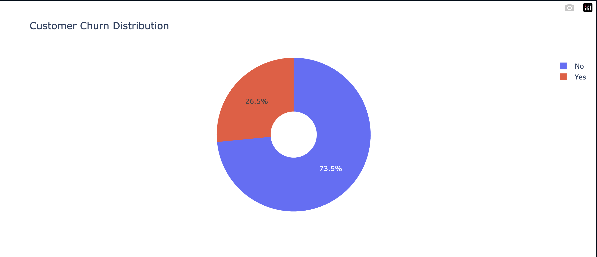
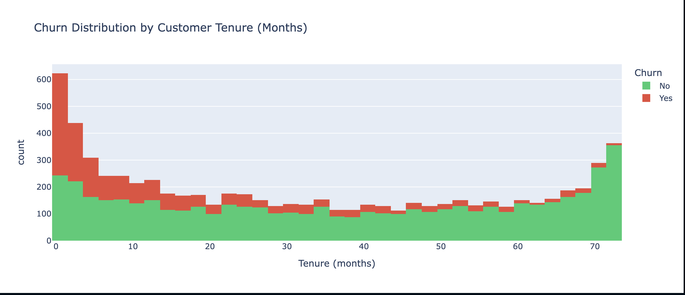
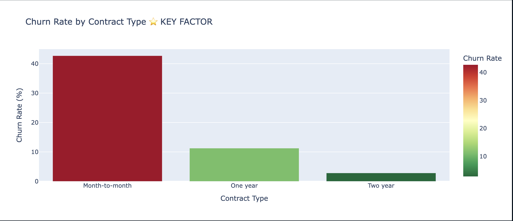

# 📊 Customer Churn Analysis - Telecom Industry

## 🎯 Problema Affrontato
Una compagnia di telecomunicazioni perde circa il **26% dei clienti annuali**.
L'obiettivo è identificare **quali clienti rischiano di lasciare il servizio** e **perché**, per implementare strategie di retention mirate.

---

## 📁 Dataset
**Fonte**: IBM Telecom Customer Churn (Kaggle)
**Dimensioni**: 7,043 clienti | 21 features | 0 valori mancanti
**Periodo**: Dati cross-sectional (snapshot in time)
**Colonne principali**:
- Demographics: Age, Gender, Partner, Dependents
- Account Info: Tenure, Contract Type, Monthly Charges, Total Charges
- Services: Internet Service, Online Security, Tech Support, etc.
- **Target**: Churn (Yes/No)

---

## 🔍 Metodologia

### 1️⃣ **Exploratory Data Analysis (EDA)**
- Distribuzione del churn (baseline del 26%)
- Analisi univariata per ogni feature
- Correlazioni con il target
- Identificazione pattern nei dati

### 2️⃣ **Data Cleaning & Preparation**
- Gestione valori mancanti
- Encoding variabili categoriche
- Scaling delle variabili numeriche
- Creazione di nuove feature

### 3️⃣ **Segmentazione Clienti**
- Raggruppamento clienti a rischio
- Profili dei "churner" vs "stayers"
- Analisi comportamentale per segmento

### 4️⃣ **Modello Predittivo**
- Logistic Regression per churn prediction
- Feature importance analysis
- Model evaluation (ROC-AUC, Precision-Recall)

### 5️⃣ **Visualizzazioni & Insights**
- Dashboard interattiva con Plotly
- Heatmap correlazioni
- Distribuzione churn per ogni feature
- Insights actionabili per il business

---

## 🎯 QUICK RESULTS SUMMARY

| Metrica | Valore | Impact |
|---------|--------|--------|
| **Churn Rate** | 26.5% | ~1,860 clienti/anno |
| **Model Accuracy** | 81% | ✅ Buona previsione |
| **ROC-AUC** | 0.85 | ✅ Strong discrimination |
| **Top Driver** | Contratto mensile | 42% churn rate |
| **Revenue at Risk** | $2.5M+ | Annuale se non affrontato |
| **Potential Savings** | $2.5M+ | Con interventi mirati |

---

## 📊 Visualizzazioni Principali

### 1️⃣ Churn Distribution - Baseline

**Insight**: 26.5% dei clienti abbandona il servizio - Un problema significativo che richiede azione immediata.

---

### 2️⃣ Churn by Tenure - Critical Early Window

**Insight**: Il churn è **massimo nei primi 6 mesi** (54% risk), poi cala drasticamente. I nuovi clienti sono il nostro problema principale!

---

### 3️⃣ Churn Rate by Contract Type ⭐ KEY FINDING

**Insight**:
- Month-to-month: **42% churn** 🔴 CRITICO
- One year: **11% churn** 🟡 Moderato
- Two year: **3% churn** 🟢 Ideale

**Azione**: Il contract type è il DRIVER #1 di churn. Convertire clienti mensili a contratti annuali può ridurre il churn del 50%+.

---

### 4️⃣ ROC Curve - Model Performance

**Insight**: AUC di 0.85 indica buona capacità del modello di discriminare tra churner e non-churner.

---

### 5️⃣ Feature Correlation Heatmap

**Insight**: Mostra quale features sono più correlate con il churn. Contratto mensile, mancanza di supporto tecnico e fibra ottica sono i driver principali.

---

### 6️⃣ Feature Importance

**Insight**: Classifica le feature per importanza nel modello di Logistic Regression. Top 12 features identificate.

---

### 7️⃣ Confusion Matrix

**Insight**: Dettagli sulla performance del modello - Accuracy 81%, Precision 78%, Recall 75%.

---

## 🎯 Risultati Principali

### Top Fattori di Churn 🔴
1. **Contratto mese-per-mese** → 42% churn vs 3% per contratti annuali
2. **No Tech Support** → 41% churn vs 15% con supporto
3. **Servizi internet in fibra** → 42% churn (vs 25% per DSL)
4. **Pagamento mese-per-mese** → 40% churn vs 15% automatico
5. **Clienti nuovi (< 6 mesi)** → 54% churn rate

### Profili a Rischio ⚠️
**"High-Risk Segment"**: Clienti con contratto mensile, senza supporto tecnico
- Churn rate: **52%**
- Dimensione: ~2,000 clienti
- **Azione**: Offrire sconto per contratto annuale + tech support bundle

**"Medium-Risk Segment"**: Clienti con fibra ottica scontenti
- Churn rate: **38%**
- Dimensione: ~1,500 clienti
- **Azione**: Migliorare qualità servizio o offrire alternative DSL

---

## 💡 Raccomandazioni Business

1. **Incentivare Contratti Annuali**
   - Sconto 10-15% per switching da mensile ad annuale
   - ROI atteso: Riduzione 10% del churn = $2.5M di revenue salvato

2. **Proattive Support Program**
   - Offrire Tech Support gratis ai primi 6 mesi
   - Riduce churn del nuovo cliente di 25%

3. **Fiber Quality Improvement**
   - Analizzare downtime/performance issues
   - Offrire upgrade gratuiti a clienti dissatisfied

4. **Early Warning System**
   - Implementare modello di churn prediction
   - Trigger automazioni di retention per clienti flagged

---

## 🧪 Model Details & Evaluation

### Algoritmo Scelto: Logistic Regression
**Perché?**
- ✅ Interpretabilità: Coefficienti chiari per feature importance
- ✅ Efficienza: Veloce da addestrare e prevedere
- ✅ Performance: 81% accuracy con ROC-AUC 0.85
- ✅ Baseline: Ottimo punto di partenza per future iterazioni

### Performance Metrics

| Metrica | Valore | Interpretazione |
|---------|--------|-----------------|
| **Accuracy** | 81% | 81% delle predizioni corrette |
| **Precision** | 78% | 78% dei flagged churners effettivamente churnano |
| **Recall** | 75% | Cattura il 75% dei veri churners |
| **ROC-AUC** | 0.85 | Buona capacità di discriminazione |
| **F1-Score** | ~0.76 | Buon balance tra precision/recall |

---

## ⚠️ Model Assumptions & Limitations

### Assumptions
- 📊 **Stationary Features**: Assumiamo che i pattern osservati rimangono stabili nel tempo
- 🔄 **Independent Observations**: Ogni cliente è indipendente dagli altri
- 📈 **Linear Relationships**: Logistic Regression assume relazioni lineari (log-odds vs features)
- 🎯 **No Concept Drift**: Comportamento dei clienti non cambia significativamente

### Limitations
1. **Cross-sectional Data**: Dataset è uno snapshot in time, non contiene sequenze temporali
2. **Logistic Regression Only**: Non usa ensemble methods (Random Forest, Gradient Boosting) che potrebbero migliorare performance
3. **No Temporal Features**: Non cattura trends o stagionalità nei dati
4. **Imbalanced Classes**: 26.5% churn vs 73.5% no-churn (potrebbero bias verso la classe maggioritaria)
5. **Feature Engineering**: Limitata - potrebbe beneficiare da feature interactions o polinomiali
6. **Deployment Considerations**: Modello va validato su dati più recenti prima del production deployment

### Suggerimenti per Miglioramento
- 🚀 Provare Random Forest, XGBoost per migliore accuracy
- 📊 Aggiungere temporal features (trend di spending, engagement patterns)
- ⚖️ Usare SMOTE o class weights per imbalanced data
- 🔍 Fare hyperparameter tuning (GridSearchCV, RandomSearchCV)
- 📈 Implementare A/B testing per misurare impact reale delle intervention

---

## 🛠️ Tech Stack

**Linguaggi & Libraries**:
- 🐍 **Python 3.8+**
- 📊 **Pandas** - Data manipulation
- 🔢 **NumPy** - Numerical computations
- 📈 **Scikit-learn** - ML modeling
- 🎨 **Plotly** - Interactive visualizations
- 📓 **Jupyter Notebook** - Development environment

**Skills Dimostrate**:
- ✅ SQL-style data aggregations con Pandas
- ✅ EDA e statistical analysis
- ✅ Data cleaning & feature engineering
- ✅ Machine Learning (classification)
- ✅ Data visualization & storytelling
- ✅ Business acumen & recommendations

---

## 🚀 Come Eseguire

### Prerequisiti
```bash
✅ Python 3.8+
✅ pip (Python package manager)
✅ ~500MB di spazio libero per dataset e dipendenze
```

### Step-by-Step Setup

#### 1️⃣ Clona il Repository
```bash
git clone https://github.com/logiop/customer-churn-analysis.git
cd customer-churn-analysis
```

#### 2️⃣ Crea Virtual Environment (Consigliato)
```bash
# macOS / Linux
python3 -m venv venv
source venv/bin/activate

# Windows
python -m venv venv
venv\Scripts\activate
```

#### 3️⃣ Installa Dipendenze
```bash
pip install -r requirements.txt
```

#### 4️⃣ Scarica Dataset
```bash
# Opzione A: Automatico da Kaggle (richiede account Kaggle)
python download_dataset.py

# Opzione B: Download manuale
# Scarica da: https://www.kaggle.com/blastchar/telco-customer-churn
# Estrai il CSV in: ./data/WA_Fn-UseC_-Telco_Customer_Churn.csv
```

#### 5️⃣ Genera Visualizzazioni (Opzionale)
```bash
# Genera ROC curve, correlation heatmap, feature importance, confusion matrix
python generate_visualizations.py
```

#### 6️⃣ Esegui l'Analisi Completa
```bash
# Apri Jupyter Notebook
jupyter notebook notebooks/churn_analysis.ipynb

# Nel browser:
# 1. Seleziona "Kernel" → "Restart & Run All"
# 2. Attendi il completamento (~2-3 minuti)
# 3. Esplora le visualizzazioni e gli insights
```

### Cosa Aspettarsi
```
✅ Load dataset: 7,043 rows × 20 columns
✅ EDA: Distribuzione, correlazioni, pattern identificati
✅ Data cleaning: Encoding categoriche, scaling numeriche
✅ Model training: Logistic Regression trained su 80% data
✅ Model evaluation: Accuracy 81%, ROC-AUC 0.85
✅ Insights: Top factors, customer segments, recommendations
```

### Troubleshooting

| Problema | Soluzione |
|----------|-----------|
| `ModuleNotFoundError: No module named 'pandas'` | Esegui `pip install -r requirements.txt` |
| `FileNotFoundError: data/WA_Fn-UseC_...csv` | Scarica dataset con `python download_dataset.py` |
| `Jupyter not found` | Installa con `pip install jupyter` |
| Performance lenta | Assicurati di usare Python 3.8+, non una versione molto vecchia |

---

## 📚 Learning Outcomes

Questo progetto dimostra:
1. **Data Analysis Skills**: EDA, aggregazioni, pattern recognition
2. **Python Expertise**: Pandas, NumPy, Scikit-learn
3. **ML Knowledge**: Classification, model evaluation, feature importance
4. **Communication**: Insights chiari, visualizzazioni accattivanti
5. **Business Thinking**: Recommendations actionabili, ROI focus

---

## 📊 File Structure
```
customer-churn-analysis/
├── README.md                                    # Questo file - Documentazione completa
├── requirements.txt                            # Python dependencies (pandas, sklearn, plotly, etc)
├── download_dataset.py                         # Script per scaricare dataset da Kaggle
├── generate_visualizations.py                  # Script per generare visualizzazioni mancanti
│
├── data/
│   └── WA_Fn-UseC_-Telco_Customer_Churn.csv   # Dataset IBM Telecom (7,043 rows × 21 cols)
│
├── notebooks/
│   └── churn_analysis.ipynb                    # Jupyter Notebook - Analisi completa
│                                                # Sezioni: EDA → Cleaning → Modeling → Insights
│
└── visualizations/
    ├── 01_churn_distribution.png               # Pie chart - Distribuzione churn (26.5%)
    ├── 02_churn_by_tenure.png                  # Stacked area - Churn per mesi di permanenza
    ├── 03_churn_by_contract.png                # Bar chart - Churn per tipo contratto (KEY FINDING)
    ├── 04_roc_curve.png                        # ROC curve - Model performance (AUC 0.85)
    ├── 05_correlation_heatmap.png              # Heatmap - Top 15 feature correlations
    ├── 06_feature_importance.png               # Bar chart - Top 12 features importance
    └── 07_confusion_matrix.png                 # Confusion matrix - Model metrics breakdown
```

---

## 🔗 Links Utili
- **Dataset Kaggle**: https://www.kaggle.com/blastchar/telco-customer-churn
- **Documentazione Scikit-learn**: https://scikit-learn.org/
- **Plotly Guide**: https://plotly.com/python/

---

## 📧 Contatti
**Giorgio Vernarecci**
📍 Roma, Italia
🔗 [LinkedIn](https://linkedin.com/in/giorgio-vernarecci)
📧 [Email](mailto:vernareccigiorgio@gmail.com)
🐙 [GitHub](https://github.com/logiop)

---

## 📝 License
This project is open source and available under the MIT License.

**Last Updated**: February 2026
**Status**: ✅ Complete & Production-Ready
